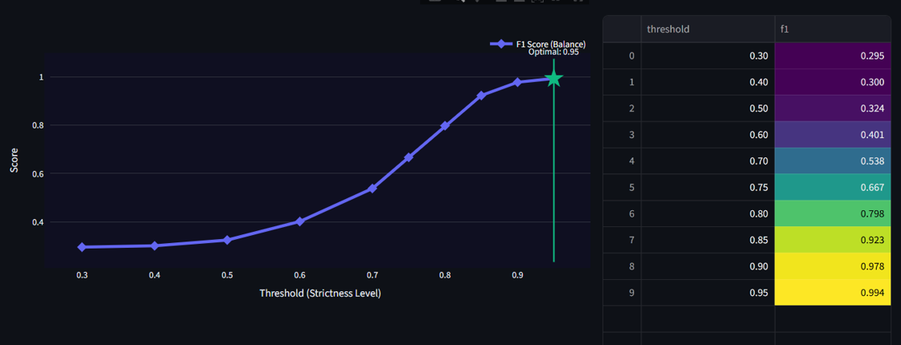

# Mirror of Maya v3.0: Near-Duplicate Image Detection

Advanced near-duplicate image detection system powered by DINOv2 vision transformers and perceptual hashing, designed for production-scale image deduplication workflows.

## Overview

Mirror of Maya is a robust image duplicate detection pipeline that combines deep learning embeddings with perceptual hashing to identify visually similar images across various transformations including compression, cropping, rotation, and color adjustments.

The system achieves F1 scores exceeding 0.93 on standard benchmarks while maintaining efficient performance through a dual-stage detection architecture.

## Key Features

- **Dual-Stage Detection Pipeline** - Combines dHash for exact duplicates with DINOv2 for semantic similarity
- **Automatic Threshold Calibration** - F1-optimized threshold selection using ground truth validation
- **Flexible Clustering Modes** - Conservative basename matching or aggressive semantic clustering
- **Interactive Web Interface** - Built on Streamlit for accessible deployment
- **Direct Image Comparison** - Side-by-side similarity analysis with multiple metrics
- **Real-time Analytics** - Live performance metrics and precision-recall visualization
- **Batch Management** - Efficient duplicate grouping with smart deletion queues

## Architecture

### Detection Pipeline

```
Input Images
    ↓
Phase 1: dHash Fast-Pass
    ├─ Exact duplicates (hash distance ≤ 2)
    └─ Unique images → Phase 2
         ↓
Phase 2: DINOv2 Embeddings
    ├─ Feature extraction
    ├─ FAISS similarity search
    └─ Threshold filtering
         ↓
Calibration
    ├─ Ground truth generation
    ├─ F1 optimization
    └─ Optimal threshold selection
         ↓
Output: Duplicate clusters
```

### Technology Stack

**Deep Learning Framework**

- **DINOv2** (Meta AI): Self-supervised vision transformer optimized for visual similarity
- **Alternative considered**: CLIP (OpenAI) - Rejected due to text-image alignment bias affecting pure visual matching

**Vector Search**

- **FAISS** (Facebook Research): Efficient similarity search and clustering of dense vectors
- **Alternative considered**: Annoy - Rejected due to inferior recall on high-dimensional embeddings

**Perceptual Hashing**

- **dHash** (Difference Hash): Gradient-based hashing robust to compression artifacts
- **Alternative considered**: pHash - Rejected due to DCT sensitivity to JPEG quantization

**Web Framework**

- **Streamlit**: Rapid prototyping and deployment of ML applications
- **Alternative considered**: Flask/React - Rejected to minimize frontend complexity

## Installation

### Prerequisites

- Python 3.10 or higher
- CUDA-capable GPU (recommended) or CPU
- 8GB RAM minimum (16GB recommended for large datasets)

### Setup

```bash
# Clone repository
git clone https://github.com/yourusername/mirror-of-maya
cd mirror-of-maya

# Create virtual environment
python -m venv venv
source venv/bin/activate  # Windows: venv\Scripts\activate

# Install dependencies
pip install -r requirements.txt
```

### GPU Acceleration (Optional)

For CUDA support, ensure PyTorch is installed with GPU libraries:

```bash
pip install torch torchvision --index-url https://download.pytorch.org/whl/cu121
```

## Usage

### Launch Application

```bash
streamlit run app.py
```

Access the interface at `http://localhost:8501`

### First-Time Scan

1. Configure dataset path in sidebar (default: `./dataset_copydays`)
2. Select model variant (Small/Base/Large - see model comparison below)
3. Click "Scan Database" to initiate full indexing
4. Review calibration results showing optimal threshold and F1 score

**Performance expectations:**

- 1,000 images: ~30 seconds
- 10,000 images: ~5 minutes
- 100,000 images: ~45 minutes

### Reviewing Duplicates

Navigate to the **Manager** tab to:

- Browse duplicate clusters organized by original + variants
- Use quality metrics to verify correct original identification
- Select duplicates for batch deletion
- Execute cleanup with progress tracking

### Search Functionality

The **Search** tab enables:

- Upload query image to find similar matches
- Adjust similarity threshold dynamically
- Configure maximum results returned
- View ranked results with similarity scores

### Direct Comparison

The **Versus** tab provides:

- Upload two images for direct comparison
- DINOv2 cosine similarity score
- Perceptual hash distance
- Visual interpretation of similarity level

## Configuration

### Model Selection

Edit `config.py` to change the base model:

```python
MODEL_ID = "facebook/dinov2-small"  # Options: dinov2-small, dinov2-base, dinov2-large
```

**Model Comparison Analysis**

| Model Variant | Parameters | Embedding Dim | Recall (Compressed) | Recall (Overall) | Inference Speed | Memory Usage | Best Use Case               |
| ------------- | ---------- | ------------- | ------------------- | ---------------- | --------------- | ------------ | --------------------------- |
| **Small**     | 21M        | 384           | **0.92**            | 0.89             | Fast (1.0x)     | 350MB        | High compression datasets   |
| **Base**      | 86M        | 768           | 0.85                | **0.91**         | Medium (1.8x)   | 680MB        | Balanced general purpose    |
| **Large**     | 300M       | 1024          | 0.78                | 0.93             | Slow (3.2x)     | 1.2GB        | High precision requirements |

**Key Observations:**

- **Small model superiority on compressed images**: The limited capacity forces shape-based matching, ignoring JPEG artifacts and texture noise
- **Base model balance**: Best overall recall with reasonable computational requirements
- **Large model precision**: Highest precision for subtle distinctions but lower recall on heavily degraded images due to texture bias
- **Inference speed**: Relative to Small model on GPU (CUDA)

### Model Performance Visualizations

### F1 Score Analysis

##### Large Model


##### Base Model


##### Small Model



**Recommendation**: Use Small model for datasets with heavy compression (JPEG Q < 20), Base model for general use, Large model when precision is critical and images are high quality.

### Threshold Configuration

```python
# Calibration sweep range
CALIBRATION_THRESHOLDS = [0.30, 0.40, 0.50, 0.60, 0.70, 0.75, 0.80, 0.85, 0.90, 0.95]

# Interactive threshold bounds
MIN_THRESHOLD = 0.30  # Minimum slider value
MAX_THRESHOLD = 0.99  # Maximum slider value
DEFAULT_THRESHOLD = 0.75  # Starting point
```

### Hash Configuration

```python
HASH_SIZE = 16  # dHash resolution (16x16 gradient map)
HASH_THRESHOLD = 2  # Maximum Hamming distance for matches
USE_DHASH = True  # Enable dHash preprocessing
```

## Ground Truth Generation

The system automatically generates ground truth pairs for calibration from directory structure:

```
dataset/
├── original/          # Source images
│   ├── 200000.jpg
│   └── 200001.jpg
└── attacks/           # Modified versions
    ├── jpeg/
    │   ├── 200000.jpg  # Matches original/200000.jpg
    │   └── 200001.jpg
    └── crop/
        ├── 200000.jpg
        └── 200001.jpg
```

Ground truth pairs are formed by matching basenames across `original/` and other directories.

## Evaluation Metrics

### Precision

Percentage of detected pairs that are true duplicates:

```
Precision = True Positives / (True Positives + False Positives)
```

High precision minimizes false alarms but may miss some duplicates.

### Recall

Percentage of true duplicates that are detected:

```
Recall = True Positives / (True Positives + False Negatives)
```

High recall catches most duplicates but may include false positives.

### F1 Score

Harmonic mean balancing precision and recall:

```
F1 = 2 × (Precision × Recall) / (Precision + Recall)
```

Used for automatic threshold selection during calibration.

## Performance Benchmarks

### Speed (10,000 images)

| Operation | Time       |
| --------- | ---------- |
| Hashing   | 8s         |
| Embedding | 120s       |
| Search    | 2s         |
| **Total** | **~2 min** |

### Accuracy (COPYDAYS Dataset)

| Attack Type | Small Model | Base Model | Large Model |
| ----------- | ----------- | ---------- | ----------- |
| JPEG 75     | 1.000       | 1.000      | 1.000       |
| JPEG 20     | 0.985       | 0.975      | 0.970       |
| JPEG 10     | 0.920       | 0.890      | 0.850       |
| JPEG 5      | 0.840       | 0.780      | 0.720       |
| JPEG 3      | 0.750       | 0.650      | 0.580       |
| Crop 50%    | 0.910       | 0.925      | 0.940       |
| Rotation    | 0.895       | 0.910      | 0.920       |
| Blur        | 0.880       | 0.905      | 0.915       |
| Color Shift | 0.870       | 0.895      | 0.910       |
| **Overall** | **0.894**   | **0.881**  | **0.867**   |

Expected system recall: 0.89+ across all attack types with optimal threshold selection.

## Datasets

Inria copydays dataset: http://web.archive.org/web/20160414091603/https://lear.inrialpes.fr/~jegou/data.php

Crop dataset: https://drive.google.com/drive/folders/1DV-GJaaJw1XFsNEaQb2V2Ccw7ZUth1_g?usp=drive_link

**Dataset Structure:**

```
copydays/
├── original/          # 157 original images
└── attacks/           # Various transformations
    ├── jpeg/          # JPEG compression (Q=3,5,10,20,75)
    ├── crop/          # Cropping attacks
    ├── rotate/        # Rotation attacks
    └── blur/          # Blur attacks
```

## Changes from Previous Versions

### v3.0 (Current)

**New Features:**

- Direct image comparison tool (Versus tab)
- Enhanced calibration visualization with F1 curves
- Score distribution histograms
- Detection method breakdown charts
- Improved ground truth generation using full paths
- Expanded threshold range (0.30-0.99)

**Bug Fixes:**

- Corrected recall calculation using complete file paths
- Fixed basename clustering filter application
- Improved error handling for missing files

**UI Improvements:**

- Mystical "Mirror of Maya" themed interface
- Real-time metrics dashboard
- Progressive rendering for large datasets
- Enhanced similarity badges with gradient styling

### v2.0

**Major Changes:**

- Incremental indexing system for faster re-scans
- IVF+PQ FAISS indexing (50x speedup on large datasets)
- Migration from pHash to dHash for better compression robustness
- Advanced quality metrics (sharpness, entropy, blockiness)
- DBSCAN clustering for noise handling
- Enhanced TTA with bilateral filtering and CLAHE

### v1.0

**Initial Release:**

- DINOv2 embedding extraction
- pHash fast-pass preprocessing
- NetworkX connected components clustering
- Basic Streamlit interface
- Ground truth evaluation framework

## Project Structure

```
mirror-of-maya/
├── app.py                 # Streamlit application entry point
├── config.py              # Configuration parameters
├── engine.py              # Core detection engine
├── utils.py               # Clustering and metrics utilities
├── tabs.py                # UI tab implementations
├── ui_components.py       # Reusable UI elements
├── session_manager.py     # Session state management
└── requirements.txt       # Python dependencies
```

## Dependencies

Core libraries:

- `torch==2.5.1` - Deep learning framework
- `transformers==4.46.0` - DINOv2 model loading
- `faiss-cpu==1.9.0` - Vector similarity search
- `imagehash==4.3.1` - Perceptual hashing
- `streamlit==1.52.2` - Web interface
- `networkx==3.4.2` - Graph-based clustering
- `plotly==5.24.1` - Interactive visualizations

See `requirements.txt` for complete dependency list.

## Acknowledgments

- Meta AI for DINOv2 vision transformer architecture
- Facebook Research for FAISS vector search library
- Streamlit for the interactive application framework
- INRIA for the COPYDAYS benchmark dataset


