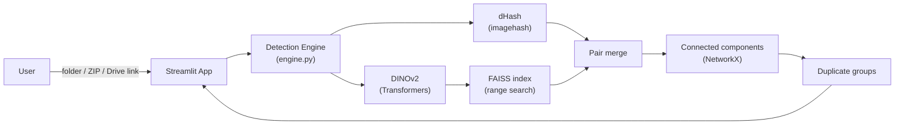
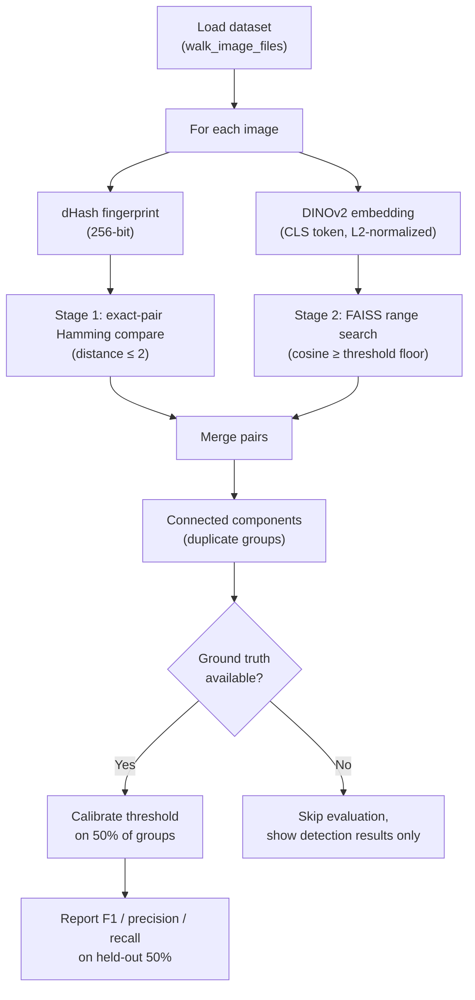
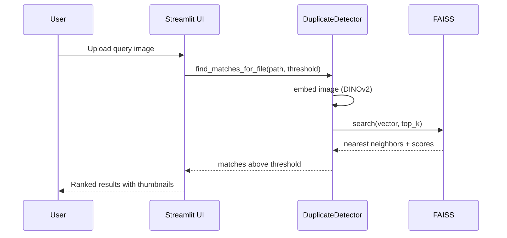

# Mirror of Maya

**Near-duplicate image detection with self-measured accuracy.**

Mirror of Maya finds copies of the same image inside a photo collection, even when the copies have been compressed, cropped, rotated, resized, or recolored. It combines perceptual hashing for exact copies with DINOv2 vision-transformer embeddings for visually modified copies, and — whenever the dataset supplies ground truth — it reports precision, recall, and F1 on a held-out split it has never seen.

**Live demo:** [mirrorofmaya.streamlit.app](https://mirrorofmaya.streamlit.app/) — boots with a prebuilt index of the INRIA Copydays benchmark (2,826 images) so results are visible immediately, no upload required.

---

## Table of contents

- [Problem](#problem)
- [Features](#features)
- [Tech stack](#tech-stack)
- [System architecture](#system-architecture)
- [Processing pipeline](#processing-pipeline)
- [Installation](#installation)
- [Usage](#usage)
- [Configuration](#configuration)
- [Dataset conventions for evaluation](#dataset-conventions-for-evaluation)
- [Project structure](#project-structure)
- [Results](#results)
- [Design decisions](#design-decisions)
- [Future improvements](#future-improvements)
- [Acknowledgments](#acknowledgments)

## Problem

Photo libraries accumulate duplicates silently: the same picture re-saved at a lower JPEG quality, cropped for a social post, resized for a thumbnail, or re-exported after a color edit. Filename- or checksum-based dedup misses all of these because the bytes differ. Mirror of Maya instead compares what the images *look like*, catching both byte-identical copies and visually-modified ones, and quantifies how well it does that on benchmark data instead of asserting it.

## Features

- **Two-stage detection** — a dHash pass for exact copies, then DINOv2 embeddings with FAISS range search for modified copies
- **Any image source** — a local folder path, an uploaded ZIP, or a Google Drive link
- **Honest evaluation** — automatic threshold calibration with a proper holdout split whenever the dataset has ground truth
- **Duplicate groups** — built by graph connected components, with the best-quality file suggested as the keeper
- **Reverse image search** — upload an image, find its copies in the indexed collection
- **Pairwise comparison** — similarity verdict for any two uploaded images (embedding cosine + hash distance)
- **Safe cleanup** — selected files move to a trash folder with one-click undo; nothing is ever permanently deleted

## Tech stack

| Layer | Technology |
| --- | --- |
| Embeddings | DINOv2 via HuggingFace Transformers (PyTorch) |
| Vector search | FAISS — range search on a flat inner-product index |
| Exact-copy hashing | imagehash (dHash) |
| Grouping | NetworkX connected components |
| Interface | Streamlit + Plotly |
| Data handling | NumPy, pandas |

## System architecture



`app.py` wires together `ui_components` (sidebar, scan flow, demo loading), `tabs` (the seven UI tabs), `session_manager` (Streamlit session state and local persistence), and `engine.DuplicateDetector` (the actual detection logic). `utils` holds the pure functions shared across all of them: ground-truth construction, pairwise metrics, and clustering.

## Processing pipeline



**Stage 1 — exact copies.** Every image is reduced to a 256-bit dHash fingerprint (a 16x16 map of brightness gradients). All fingerprints are compared against all others directly. Pairs within a Hamming distance of 2 are exact or near-exact copies — for example the same photo saved at a different JPEG quality.

**Stage 2 — modified copies.** Every image, including the exact copies from Stage 1, is embedded with DINOv2 (CLS token, L2-normalized), processed in batches. A FAISS range search returns every pair whose cosine similarity exceeds the threshold — there is no top-k cutoff, so large duplicate groups are found completely.

**Grouping.** Detected pairs form a graph; connected components become duplicate groups. The keeper is chosen by image quality (resolution, then file size). Filenames are never used for detection.

**Evaluation** (benchmark datasets only). If copies share filenames across folders (the Copydays convention) or carry an `_aug_*` suffix, the app builds ground-truth pairs from that structure and measures itself:

1. Image groups are split 50/50 into a calibration half and a held-out half.
2. The threshold is swept from 0.40 to 0.99 in steps of 0.01, and the F1-optimal value is chosen on the calibration half only.
3. Precision, recall, and F1 are reported on the held-out half, which the calibration never saw.

Pairs are always compared by full file path. Filenames only ever build the answer key; the detector itself never sees them. Scanning an ordinary folder of photos works the same way, just without the accuracy scores.

**Reverse image search**, used by the Search tab, is a lighter path through the same engine:



## Installation

Requires Python 3.10 or newer.

```bash
git clone https://github.com/PrateekSingh438/Mirror-Of-Maya-Near-Duplicate-Image-Detection-
cd Mirror-Of-Maya-Near-Duplicate-Image-Detection-

python -m venv venv
source venv/bin/activate        # Windows: venv\Scripts\activate

pip install -r requirements.txt
```

For CPU-only deployments (Streamlit Community Cloud, Hugging Face Spaces), install torch from the CPU wheel index first to avoid downloading CUDA libraries:

```bash
pip install torch --index-url https://download.pytorch.org/whl/cpu
pip install -r requirements.txt
```

## Usage

```bash
streamlit run app.py
```

On launch the app preloads the demo corpus if `demo_bundle/` exists. To scan your own images:

1. Pick a dataset in the sidebar: a local folder path, an uploaded ZIP, or a Google Drive link to a ZIP.
2. Click **Scan for duplicates**. A progress bar tracks indexing.
3. Browse results in the tabs:
   - **Dashboard** — summary metrics, and accuracy charts when ground truth exists
   - **Manager** — duplicate groups with thumbnails; select files and move them to trash (undo available)
   - **Search** — upload an image to find its copies in the collection
   - **Analytics** — full pair listing and score statistics
   - **Exact Copies** — pairs caught by hashing alone
   - **Compare** — similarity verdict for any two uploaded images
   - **How It Works** — the architecture explained inside the app
4. Adjust the similarity threshold slider at any time; results update without re-scanning.

Deleted files go to a `.maya_trash` folder inside the dataset, never to permanent deletion, and the most recent deletion can be undone from the Manager tab.

## Configuration

Key values in `config.py`:

```python
DEFAULT_MODEL_ID = "facebook/dinov2-small"   # also: dinov2-base, dinov2-large
BATCH_SIZE = 16                # images per forward pass

HASH_SIZE = 16                 # 16x16 dHash (256 bits)
HASH_THRESHOLD = 2             # max Hamming distance for an exact copy

SCAN_THRESHOLD_FLOOR = 0.40
DEFAULT_THRESHOLD = 0.75       # used when no ground truth exists for calibration
MIN_THRESHOLD, MAX_THRESHOLD = 0.40, 0.99

CALIBRATION_HOLDOUT_FRACTION = 0.5
CALIBRATION_SEED = 42

MAX_UPLOAD_IMAGES = 500        # hosted-app cap on scanned images per session
MAX_ZIP_ENTRIES = 10_000       # zip-bomb guard: entry count, checked pre-extraction
MAX_ZIP_UNCOMPRESSED_MB = 2_000  # zip-bomb guard: uncompressed size, checked pre-extraction
```

The dataset path can also be set with the `MAYA_DATASET_PATH` environment variable (defaults to `./dataset_copydays`).

## Dataset conventions for evaluation

Accuracy scores appear only when the dataset structure provides an answer key. Two conventions are recognized:

```
copydays/                          generated/
  original/200000.jpg                berlin_1.jpg
  jpeg/10/200000.jpg                 berlin_1_aug_crop.jpg
  crops/crop_50_percent/200000.jpg   berlin_1_aug_rot.jpg
```

Left: copies share a filename across folders. Right: copies carry an `_aug_*` suffix. Any other folder of images is scanned normally with the accuracy section hidden.

The Copydays benchmark is available from the [INRIA archive](http://web.archive.org/web/20160414091603/https://lear.inrialpes.fr/~jegou/data.php).

## Project structure

```
app.py                  Streamlit entry point
config.py               All configuration
engine.py               Detection engine: hashing, embeddings, FAISS, calibration
utils.py                Ground truth, pairwise metrics, clustering
session_manager.py      Streamlit session state and local-only persistence
ui_components.py        Sidebar, scan flow, demo loading, threshold control
tabs.py                 The seven UI tabs
build_demo_bundle.py    Builds demo_bundle/ and demo_samples/ from the dataset
demo_bundle/            Prebuilt demo index (embeddings, thumbnails, calibration)
demo_samples/           One-click query images for the Search tab
requirements.txt        Dependencies
```

## Results

All numbers below were produced by this exact code on the INRIA Copydays benchmark (157 source images, 2,826 files, 24,021 ground-truth duplicate pairs) on CPU. They are reproducible with a single scan from the app.

**Held-out pairwise metrics** (threshold chosen on the calibration half, scored on the unseen half):

| Model | Threshold | F1 | Precision | Recall | Index time (CPU) |
| --- | --- | --- | --- | --- | --- |
| dinov2-small | 0.52 | 0.791 | 0.758 | 0.827 | 4 min 20 s |
| dinov2-base | 0.58 | **0.849** | **0.913** | 0.794 | 16 min 20 s |

**Recall by attack type** (fraction of modified copies traced back to their source image):

| Attack | dinov2-small | dinov2-base |
| --- | --- | --- |
| JPEG quality 75 | 100% | 100% |
| JPEG quality 50 | 100% | 100% |
| JPEG quality 30 | 100% | 100% |
| JPEG quality 20 | 100% | 100% |
| JPEG quality 15 | 100% | 100% |
| JPEG quality 10 | 100% | 100% |
| JPEG quality 8 | 100% | 100% |
| JPEG quality 5 | 99.4% | 98.7% |
| JPEG quality 3 | **96.8%** | 82.2% |
| Crop keeping 75% | 100% | 100% |
| Crop keeping 70% | 100% | 100% |
| Crop keeping 60% | 100% | 100% |
| Crop keeping 50% | 100% | 100% |
| Crop keeping 40% | 100% | 99.4% |
| Crop keeping 30% | 98.7% | 97.5% |
| Crop keeping 20% | 98.1% | 91.7% |
| Crop keeping 10% | **84.1%** | 75.8% |

The two models trade off differently: **base** separates distinct but similar scenes much better (precision 0.913 vs 0.758, and its 103 predicted clusters track the 157 true groups far more closely than small's 48), while **small** is clearly stronger on heavily degraded copies (JPEG quality 3, tiny crops) and is 3.8x faster. The hosted demo uses small for CPU speed; pick base when precision matters more than extreme-degradation recall. `dinov2-large` is selectable but has not been benchmarked with this pipeline.

Stage 1 alone catches 735 of the pairs as exact copies. Raising the threshold slider in the app trades recall for stricter groups at any time, without re-scanning.

**Performance** (CPU, no GPU, `dinov2-small`, batch size 16):

| Operation | Result |
| --- | --- |
| Indexing 2,826 images (hash + embed) | 4 min 20 s (about 11 images/s) |
| Threshold calibration (60-step sweep) | 3 s |
| Single image search | about 1 s |

A CUDA GPU is used automatically when available and speeds up indexing significantly.

## Design decisions

- **DINOv2 over CLIP** — CLIP embeddings are shaped by text alignment, which hurts pure visual matching; DINOv2 is self-supervised on images alone.
- **Range search over top-k** — top-k search silently truncates large duplicate groups; range search returns every pair above the threshold.
- **Every image is embedded**, including exact copies found by hashing, so every file stays searchable and groups stay complete.
- **Calibration with a holdout split** — the threshold is tuned and the score is reported on disjoint halves of the data, so the reported F1 is a test score, not a training score.
- **Soft deletion** — cleanup moves files to a trash folder with undo; the index updates immediately so search never returns deleted files.
- **ZIP extraction is bounded** — entry count and uncompressed size are checked before anything is written to disk, so an uploaded archive can't be used to exhaust the server's disk.

## Future improvements

- Automated tests (pytest) for the pure-Python metric and clustering code, plus CI
- CLIP-based text-to-image search as an optional third stage
- Patch-level similarity heatmaps to show *where* two images match
- An attack-robustness playground for trying custom transforms against the live index
- Benchmark numbers for `dinov2-large`

## Acknowledgments

- Meta AI for DINOv2
- Facebook Research for FAISS
- INRIA for the Copydays benchmark
- Streamlit for the application framework
